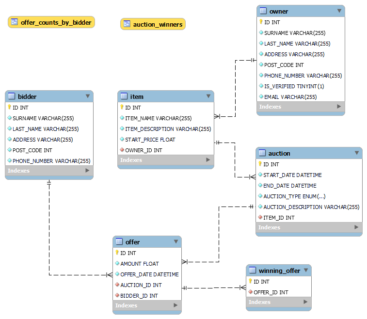

# Documentation for Database Management System

## Project Information
- **Project Name:** Database Manager
- **Author:** Erik Boháč
- **Contact:** bohac2@spsejecna.cz
- **Date:** February 4, 2024
- **School:** [Secondary School of Electrical Engineering, Praha 2, Ječná 30](https://www.spsejecna.cz/)
- **Type:** School Project
- **Project Area:** [State administration of the Czech Republic - A52](https://archi.gov.cz/znalostni_baze:seznam_agend)

## User Requirements Specification
The Database Manager system allows users to manage auctions, bidders, owners, items, and offers. Users should be able to perform actions such as creating auctions, making offers, managing bidders and owners, and generating reports on auction activities.

## Database Architecture
The database architecture follows a relational model with tables for bidders, owners, items, auctions, offers, and winning offers. Relationships are established between entities using foreign key constraints.

## Application Behavior and Flow
The application operates in two modes: user mode and manager mode. In user mode, users can interact with auctions, make offers, and view auction information. In manager mode, users have access to additional functionalities such as importing data, generating reports, and managing database tables.

## Entity-Relationship Model (ER Model)
The ER model of the database includes tables for bidders, owners, items, auctions, offers, and winning offers. Each table has its own set of attributes, and relationships are defined using primary and foreign keys.


## Import and Export Schema
The application supports importing data in XML format. Data can be imported into existing database table. Any XML import values that are missing must have text, either `None` or `Null` string. Data import file can be changed in `config/config.ini`. XML must follow format of tables as is shown in folder `data` in file `import.xml`, where the root element name does not matter - in example is used `<import>...</import>`. Than next element must contain name of table and next child elements must be columns of that table.

## Configuration Options
The program can be configured using a configuration file named `config.ini`. This file contains settings such as database connection details, logging configuration, and default values for certain parameters.

## Database Creation
Ensure you have MySQL Server X.X installed. You can download it from [Official website](https://www.mysql.com/downloads/). Project contains exported MySQL database, which can be used to create database with test data. To import it follow these steps:
##### Using MySQL Workbench:
1. **Open MySQL Workbench:** Launch MySQL Workbench on your computer.
2. **Connect to Database Server:** Connect to the MySQL database server where you want to import the database.
3. **Select Database Import:** Click on the "Server" menu and choose "Data Import."
4. **Choose Import Source:** Select the option for "Import from Self-Contained File" and browse to locate the SQL dump file you want to import.
5. **Initiate Import:** Click on the "Start Import" button to begin importing the database.
6. **Monitor Progress:** Monitor the progress of the import process within MySQL Workbench.
7. **Verify Import:** Once the import process completes, verify that the database has been successfully imported by examining its contents.

##### Using Command Line (CMD):
1. **Open Command Prompt:** Open the Command Prompt (CMD) on your computer.
2. **Navigate to MySQL Bin Directory:** If MySQL is installed, navigate to the bin directory where MySQL utilities are located. Replace X.X with your actual version of MySQL server.
```bash
cd C:\Program Files\MySQL\MySQL Server X.X\bin
```
3. **Execute MySQL Import Command:** Use the mysql command-line utility to import the database. Replace username with your MySQL username and DATABASE.sql with the path to SQL dump file.
```bash
mysql -u username -p < DATABASE.sql
```
4. **Enter Password:** After executing the command, you'll be prompted to enter the password associated with the specified MySQL user.

5. **Monitor Import Progress:** The import process will begin, and you'll see feedback in the Command Prompt indicating the progress of the import.

---
## Installation and Execution
Ensure you have `python` installed. You can do it from [Official website](https://www.python.org/downloads/). Program was tested with version `python3.11`.

To install and run the Database Manager system, follow these steps:
1. Clone the repository from [GitHub](https://github.com/erikbohac/database-management-system).
2. Navigate to the root project directory: `DatabaseManager/`.
3. Install dependencies using `pip install -r requirements.txt`.
Make sure you install it for the same version you will run script with.
4. Navigate to the `src` project directory.
5. Update the `config.ini` file with appropriate database connection details.
6. Run the main script using command `python<version> main.py`.

## Program Usage
Once the program is started, a Console will appear:
```bash 
Console:~$
```
You can manipulate with the program using this. Foe example command `help` will show all the available commands.

#### Commands:
- **Global commands:**
  - `help` - shows this table
  - `exit` - terminates the program
  - `connect` - try connection to database
  - `manager` - switch to database manager mode

- **Manager commands:**
  - `insert` - inserts new row into database
  - `update` - updates specified row
  - `delete` - deletes specified row
  - `select` - returns specified row/all rows
  - `tables` - returns all available tables
  - `import` - imports data into table
  - `report` - generates report

## Program Controll
With each command, program will inform you what to do with text in brackets. For example if you try to insert row, you will be notified to enter values with appropriate data types in angle brackets. You can skip some values by pressing `Enter` (`NULL` value will be used instead). With CRUD operations, you need to select table first.

## CRUD Operations
Program have commands for all CRUD operations. Each have specific settings.
1. **Select:** Enter values you want to filter. Only values you enter will be used to filter. That means if you skip all values, output will be all rows of given table
2. **Delete:** Enter values by which you want to make delete. For example, if you enter just one value, all the rows with that value will be deleted.
3. **Update:** Enter ID of row you wants to update. Than enter values you want to update the row with. For example if you enter into ID number 3 and into Name value 'John', the row with ID 3 will update only name to 'John'.
4. **Insert:** Enter values for new row. ID is selected automatically. If you skip any value, `NULL` value will be used.

Program will always inform you if the operation was successful or not. If you enter wrong data type, CRUD operation will be stopped. For DATE value, you can use more formats:
- YYYY.MM.DD HH.MM.SS
- YYYY/MM/DD HH/MM/SS
- YYYY-MM-DD HH-MM-SS

Where Hours, Minutes and Seconds are not required.

## Outputs
Program informs about every action with short descriptive message. Output of **SELECTs** or **REPORTs** are reformatted into table. If program is runned in small windows, the text can be scattered in the windows. Than you can just resize the windows so the text is shown correctly and will organized.

## Database Report
Program have flexible access to database views. You can obtain report generated from view. If new database view is made, program automatically detects it and can generate report based on it.

## Program Output
With each operation, program will inform you about status. If you use `SELECT` or `REPORT`, program will print data in text table as output.

## Error Handling
The application handles various error states gracefully and provides informative error messages to users. Common errors include database connection failures, invalid input data, and file loading errors.

## Third-Party Libraries
The Database Manager utilizes the following third-party libraries:
- `mysql-connector-python`: Python onnector for MySQL database

## Tests
Folder `/test` contains file [TestCase](./test/TestCase.pdf). There are prepared steps for testing various functions of the program.

## Project Summary
The Database Manager provides a comprehensive solution for managing auctions and related entities. It offers a user-friendly interface, robust database management capabilities, and extensive error handling. With its flexible configuration options and support for data import, the system meets the requirements of auction management effectively.
